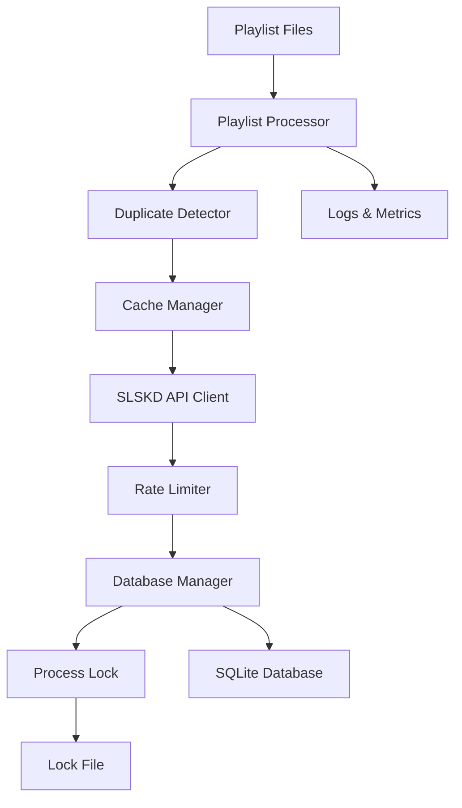

# Playlist Processor - Documentação Completa

## 📋 Visão Geral

O Playlist Processor é um sistema autônomo para processamento automático de playlists via SLSKD, com foco em downloads de arquivos FLAC de alta qualidade.

### 🎯 Características Principais

- ✅ **Processamento Sequencial**: Evita sobreposição de processos
- ✅ **Detecção de Duplicatas**: Multi-nível (exata, normalizada, fuzzy, hash)
- ✅ **Rate Limiting**: Controle inteligente de requisições
- ✅ **Cache Inteligente**: Cache de buscas com TTL configurável
- ✅ **Monitoramento**: Logs estruturados e métricas de performance
- ✅ **Recuperação de Falhas**: Tratamento robusto de erros
- ✅ **Lock de Processo**: Prevenção de execuções simultâneas

## 🏗️ Arquitetura

### Componentes Principais

```
src/playlist/
├── main.py                    # Ponto de entrada principal
├── playlist_processor.py      # Processador principal
├── slskd_api_client.py       # Cliente SLSKD API
├── database_manager.py       # Gerenciador SQLite
├── duplicate_detector.py     # Detecção de duplicatas
├── rate_limiter.py          # Controle de rate limiting
├── cache_manager.py         # Gerenciamento de cache
└── process_lock.py          # Controle de processo
```

### Fluxo de Dados



## 🚀 Instalação e Configuração

### 1. Dependências

```bash
# Instalar dependências
pip install slskd-api psutil

# Ou usar requirements.txt existente
pip install -r requirements.txt
```

### 2. Configuração .env

```bash
# SLSKD Configuration (reutilizar existente)
SLSKD_HOST=192.168.15.100
SLSKD_PORT=5030
SLSKD_API_KEY=your_slskd_api_key
SLSKD_URL_BASE=http://192.168.15.100:5030

# Playlist Processor Configuration (adicionar)
PLAYLIST_PROCESSOR_ENABLED=true
PLAYLIST_PATH=/app/data/playlists
DATABASE_PATH=/app/data/downloads.db
PROCESSOR_LOCK_PATH=/app/processor.lock

# Rate Limiting & Performance
RATE_LIMIT_SECONDS=3
CACHE_TTL_HOURS=24
MAX_CONCURRENT_DOWNLOADS=1
DUPLICATE_FUZZY_THRESHOLD=0.85

# Monitoring & Logs
LOG_LEVEL=INFO
PLAYLIST_LOG_PATH=/app/logs/playlist-processor.log
ENABLE_PERFORMANCE_METRICS=true
```

### 3. Estrutura de Diretórios

```
data/
├── playlists/           # Arquivos .txt com playlists
│   ├── rock.txt
│   ├── jazz.txt
│   └── classical.txt
├── downloads.db         # Base SQLite
└── processor.lock       # Lock file

logs/
├── playlist-processor.log
├── playlist-cleanup.log
└── playlist-health.log
```

## 📝 Formato de Playlists

### Formato Padrão

```
# Arquivo: data/playlists/rock.txt
Soundgarden - Superunknown - Black Hole Sun
Pearl Jam - Ten - Alive
Nirvana - Nevermind - Smells Like Teen Spirit
Alice in Chains - Dirt - Man in the Box
Stone Temple Pilots - Core - Interstate Love Song
```

### Regras de Formatação

- **Uma música por linha**
- **Formato**: `ARTISTA - ALBUM - MUSICA`
- **Encoding**: UTF-8
- **Linhas vazias**: Ignoradas
- **Comentários**: Linhas iniciadas com `#` são ignoradas

## 🔍 Sistema de Busca

### Padrões de Busca (Sequencial)

1. **Padrão 1**: `"ARTISTA - ALBUM - MUSICA *.flac"`
2. **Padrão 2**: `"ARTISTA - MUSICA *.flac"`
3. **Padrão 3**: `"MUSICA *.flac"`

### Filtros de Qualidade

```python
# Priorização por qualidade (ordem decrescente)
1. 24-bit / 96kHz    # Prioridade máxima
2. 16-bit / 44.1kHz  # Padrão CD
3. 24-bit / qualquer # Alta resolução
4. 16-bit / qualquer # Padrão
5. Qualquer FLAC     # Fallback
```

### Filtros de Exclusão

- Arquivos com "remix" no título
- Formatos não-FLAC
- Arquivos corrompidos/incompletos
- Duplicatas detectadas

## 🔄 Detecção de Duplicatas

### Níveis de Verificação

1. **Exata**: Comparação direta da linha do arquivo
2. **Normalizada**: Filename sem path/extensão/caracteres especiais
3. **Fuzzy**: Similaridade artista+música (threshold 85%)
4. **Hash**: MD5 de arquivos já baixados

### Algoritmo de Normalização

```python
def normalize_filename(filename):
    # Remove path e extensão
    name = os.path.splitext(os.path.basename(filename))[0]
    
    # Remove caracteres especiais
    name = re.sub(r'[^\w\s-]', '', name)
    
    # Remove números de faixa
    name = re.sub(r'^\d+[\s\-\.]*', '', name)
    
    # Lowercase e trim
    return name.lower().strip()
```

## ⚡ Rate Limiting

### Configuração

```python
# Intervalos configuráveis
RATE_LIMIT_SECONDS=3           # Mínimo entre buscas
BACKOFF_BASE_SECONDS=30        # Backoff base
SERVER_OVERLOAD_PAUSE_MINUTES=10  # Pausa em sobrecarga
```

### Estratégias

- **Linear**: Intervalo fixo entre requests
- **Exponential Backoff**: Em caso de erros
- **Adaptive**: Ajuste baseado na resposta do servidor

## 💾 Cache Inteligente

### Configuração

```python
CACHE_TTL_HOURS=24            # TTL padrão
AUTO_CLEANUP_CACHE=true       # Limpeza automática
```

### Estrutura do Cache

```sql
CREATE TABLE search_cache (
    query_hash TEXT PRIMARY KEY,
    query_text TEXT,
    results TEXT,             -- JSON dos resultados
    created_at DATETIME DEFAULT CURRENT_TIMESTAMP,
    expires_at DATETIME
);
```

### Hash de Query

```python
def get_query_hash(query):
    return hashlib.sha256(query.encode()).hexdigest()[:16]
```

## 🗄️ Banco de Dados

### Schema Principal

```sql
-- Tabela de downloads
CREATE TABLE downloads (
    id TEXT PRIMARY KEY,
    username TEXT,
    filename TEXT,
    filename_normalized TEXT,
    file_line TEXT NOT NULL,
    status TEXT NOT NULL,
    file_size INTEGER,
    file_hash TEXT,
    requested_at DATETIME,
    created_at DATETIME DEFAULT CURRENT_TIMESTAMP
);

-- Índices para performance
CREATE INDEX idx_filename_normalized ON downloads(filename_normalized);
CREATE INDEX idx_file_line ON downloads(file_line);
CREATE INDEX idx_status ON downloads(status);
```

### Estados de Download

- **SUCCESS**: Download concluído com sucesso
- **ERROR**: Falha no download (erro, cancelado, timeout)
- **NOT_FOUND**: Música não encontrada em nenhum padrão
- **DUPLICATE**: Duplicata detectada (não baixada)

## 🔒 Process Lock

### Características

- **Detecção de Locks Órfãos**: Verifica se processo ainda existe
- **Timeout**: Lock expira após tempo configurável
- **Informações Detalhadas**: PID, timestamp, hostname
- **Force Release**: Liberação forçada em emergências

### Uso

```python
# Context manager (recomendado)
with ProcessLock('/app/processor.lock') as lock:
    # Processamento protegido
    process_playlists()

# Manual
lock = ProcessLock('/app/processor.lock')
if lock.acquire():
    try:
        process_playlists()
    finally:
        lock.release()
```

## 📊 Monitoramento e Métricas

### Logs Estruturados

```json
{
    "timestamp": "2025-10-23T15:30:00Z",
    "level": "INFO",
    "action": "download_completed",
    "file_line": "Soundgarden - Superunknown - Black Hole Sun",
    "username": "user123",
    "filename": "/music/Soundgarden/01 - Black Hole Sun.flac",
    "duration_seconds": 45.2,
    "file_size_bytes": 26440248,
    "quality": "16bit/44.1kHz"
}
```

### Métricas de Performance

```python
{
    "performance_metrics": {
        "total_execution_time": 1234.56,
        "average_search_time": 2.34,
        "cache_hit_rate": 0.75,
        "database_operations": 150,
        "duplicate_detection_rate": 0.15,
        "success_rate": 0.85
    }
}
```

### Health Check

```bash
# Verificar status
python3 src/playlist/main.py --health-check

# Output esperado
{
    "status": "healthy",
    "last_execution": "2025-10-23T15:30:00Z",
    "active_downloads": 2,
    "queue_size": 5,
    "database_size_mb": 12.5,
    "cache_entries": 1250,
    "lock_status": "available"
}
```

## 🚀 Execução

### Comandos Principais

```bash
# Execução manual
python3 src/playlist/main.py

# Com logs verbosos
python3 src/playlist/main.py --verbose

# Dry run (sem downloads)
python3 src/playlist/main.py --dry-run

# Limpeza de cache
python3 src/playlist/main.py --cleanup

# Health check
python3 src/playlist/main.py --health-check

# Status detalhado
python3 src/playlist/main.py --status
```

### Docker

```bash
# Executar no container
docker-compose exec migsfy-bot python3 src/playlist/main.py

# Ver logs
docker-compose logs -f migsfy-bot | grep playlist-processor

# Health check
docker-compose exec migsfy-bot python3 src/playlist/main.py --health-check
```

## ⏰ Configuração Cron

### Instalação Automática

```bash
# Instalar cron otimizado
./scripts/setup-playlist-cron.sh install

# Verificar status
./scripts/setup-playlist-cron.sh status

# Testar configuração
./scripts/setup-playlist-cron.sh test

# Remover cron
./scripts/setup-playlist-cron.sh remove
```

### Configuração Manual

```bash
# Editar crontab
crontab -e

# Adicionar jobs
# Processamento principal (a cada 30 minutos)
*/30 * * * * cd /app && python3 src/playlist/main.py >> logs/playlist-processor.log 2>&1

# Limpeza diária (2h da manhã)
0 2 * * * cd /app && python3 src/playlist/main.py --cleanup >> logs/playlist-cleanup.log 2>&1

# Health check (a cada 5 minutos)
*/5 * * * * cd /app && python3 src/playlist/main.py --health-check >> logs/playlist-health.log 2>&1
```

## 🔧 Troubleshooting

### Problemas Comuns

#### 1. Lock File Órfão

```bash
# Verificar lock
python3 src/playlist/main.py --status

# Forçar liberação (cuidado!)
python3 -c "
from src.playlist.process_lock import ProcessLock
lock = ProcessLock('/app/processor.lock')
lock.force_release()
"
```

#### 2. Cache Corrompido

```bash
# Limpar cache
python3 src/playlist/main.py --cleanup --force

# Ou manualmente
rm -f data/downloads.db
python3 src/playlist/main.py --init-db
```

#### 3. SLSKD API Não Responde

```bash
# Verificar conectividade
curl -X GET "http://192.168.15.100:5030/api/v0/session" \
     -H "X-API-Key: your_api_key"

# Verificar logs
tail -f logs/playlist-processor.log | grep -i error
```

#### 4. Performance Lenta

```bash
# Verificar métricas
python3 src/playlist/main.py --status --verbose

# Otimizar cache
python3 src/playlist/main.py --cleanup --optimize

# Verificar rate limiting
grep "rate_limit" logs/playlist-processor.log
```

### Logs de Debug

```bash
# Habilitar debug
export LOG_LEVEL=DEBUG
python3 src/playlist/main.py --verbose

# Filtrar logs específicos
tail -f logs/playlist-processor.log | grep -E "(ERROR|WARNING|duplicate|cache)"
```

## 📈 Otimização de Performance

### Configurações Recomendadas

```bash
# Para uso intensivo
RATE_LIMIT_SECONDS=1
CACHE_TTL_HOURS=48
MAX_CONCURRENT_DOWNLOADS=3

# Para uso conservador
RATE_LIMIT_SECONDS=5
CACHE_TTL_HOURS=12
MAX_CONCURRENT_DOWNLOADS=1
```

### Monitoramento de Recursos

```bash
# Uso de CPU/Memória
ps aux | grep playlist_processor

# Tamanho do banco
du -h data/downloads.db

# Logs grandes
find logs/ -name "*.log" -size +10M
```

## 🔄 Backup e Recuperação

### Backup Automático

```bash
# Script de backup (adicionar ao cron)
#!/bin/bash
DATE=$(date +%Y%m%d_%H%M%S)
cp data/downloads.db "backups/downloads_${DATE}.db"
find backups/ -name "downloads_*.db" -mtime +7 -delete
```

### Recuperação

```bash
# Restaurar backup
cp backups/downloads_20251023_153000.db data/downloads.db

# Verificar integridade
sqlite3 data/downloads.db "PRAGMA integrity_check;"

# Recriar índices
python3 src/playlist/main.py --rebuild-indexes
```

## 📚 API Reference

### PlaylistProcessor

```python
class PlaylistProcessor:
    def __init__(self, config_path: str = None)
    def process_all_playlists(self) -> dict
    def process_playlist_file(self, filepath: str) -> dict
    def cleanup(self) -> dict
    def get_status(self) -> dict
    def health_check(self) -> dict
```

### DatabaseManager

```python
class DatabaseManager:
    def __init__(self, db_path: str)
    def init_database(self)
    def save_download(self, data: dict)
    def is_downloaded(self, file_line: str) -> bool
    def get_all_downloads(self) -> list
    def cleanup_expired_cache(self) -> int
```

### ProcessLock

```python
class ProcessLock:
    def __init__(self, lock_file: str, timeout: int = 3600)
    def acquire(self) -> bool
    def release(self)
    def is_locked(self) -> bool
    def get_lock_info(self) -> dict
    def force_release(self) -> bool
```

## 🎯 Roadmap

### Versão Atual (1.0)
- ✅ Processamento básico de playlists
- ✅ Detecção de duplicatas
- ✅ Rate limiting
- ✅ Cache inteligente
- ✅ Process lock robusto

### Próximas Versões

#### v1.1 - Melhorias de Performance
- [ ] Processamento paralelo de arquivos
- [ ] Cache distribuído
- [ ] Otimização de queries SQL

#### v1.2 - Recursos Avançados
- [ ] Interface web para monitoramento
- [ ] Notificações (email/webhook)
- [ ] Integração com outros serviços de música

#### v1.3 - Machine Learning
- [ ] Predição de qualidade de arquivos
- [ ] Recomendação inteligente de fontes
- [ ] Detecção automática de duplicatas por áudio

---

## 📞 Suporte

Para problemas ou dúvidas:

1. **Verificar logs**: `tail -f logs/playlist-processor.log`
2. **Executar health check**: `python3 src/playlist/main.py --health-check`
3. **Consultar troubleshooting**: Seção acima
4. **Abrir issue**: No repositório do projeto

---

**Última atualização**: 2025-10-23  
**Versão**: 1.0.0
