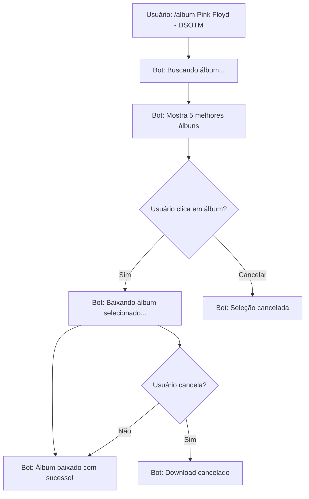

# 📱 Exemplo Visual: Nova Funcionalidade de Seleção de Álbuns

## 🎯 Como funciona na prática

### 1. Usuário envia comando
```
/album Pink Floyd - The Dark Side of the Moon
```

### 2. Bot responde com busca em andamento
```
💿 Buscando álbum: Pink Floyd - The Dark Side of the Moon
💡 Use o botão abaixo para cancelar se necessário

[🛑 Cancelar Busca]
```

### 3. Bot mostra os álbuns encontrados
```
💿 Álbuns encontrados para: Pink Floyd - The Dark Side of the Moon

📋 Selecione um álbum para baixar:

1. The Dark Side of the Moon
   👤 M3H9X
   🎵 10 faixas
   🎧 320 kbps
   💾 98.2 MB

2. The Dark Side of the Moon [Remastered]
   👤 FastAlice
   🎵 10 faixas
   🎧 320 kbps
   💾 98.5 MB

3. The Dark Side of the Moon (Deluxe)
   👤 Slicemage
   🎵 20 faixas
   🎧 320 kbps
   💾 225.2 MB

4. Pink Floyd Collection
   👤 hanky2k
   🎵 46 faixas
   🎧 320 kbps
   💾 476.8 MB

5. The Dark Side of the Moon
   👤 ruacadwallader
   🎵 9 faixas
   🎧 320 kbps
   💾 99.3 MB

[💿 1. The Dark Side of the Moon (10 faixas)]
[💿 2. The Dark Side of the Moon [Remastered] (10 faixas)]
[💿 3. The Dark Side of the Moon (Deluxe) (20 faixas)]
[💿 4. Pink Floyd Collection (46 faixas)]
[💿 5. The Dark Side of the Moon (9 faixas)]
[❌ Cancelar]
```

### 4. Usuário clica em um botão (ex: botão 3)
```
💿 Baixando Álbum Selecionado

📀 The Dark Side of the Moon (Deluxe)
👤 Usuário: Slicemage
🎵 Faixas: 20
🎧 Bitrate médio: 320 kbps
💾 Tamanho: 225.2 MB

⏳ Iniciando downloads...
💡 Use o botão abaixo para cancelar se necessário

[🛑 Cancelar Busca]
```

### 5. Resultado final
```
✅ Álbum baixado com sucesso!

📀 The Dark Side of the Moon (Deluxe)
✅ Downloads iniciados: 20
❌ Falhas: 0

💡 Monitore o progresso na interface web do slskd
```

## 🎨 Características da Interface

### ✅ Informações Claras
- **Nome do álbum** extraído do diretório
- **Usuário** que compartilha o álbum
- **Número de faixas** para comparar versões
- **Qualidade (bitrate)** para escolher melhor qualidade
- **Tamanho total** para considerar espaço/tempo

### ✅ Botões Intuitivos
- Cada álbum tem seu próprio botão
- Nome do álbum + número de faixas no botão
- Botão de cancelar sempre disponível
- Limitação automática de texto para caber no Telegram

### ✅ Ordenação Inteligente
- Álbuns com **mais faixas** aparecem primeiro
- Em caso de empate, **maior bitrate** tem prioridade
- Remove **duplicatas** automaticamente
- Mostra apenas os **5 melhores** para não sobrecarregar

### ✅ Feedback em Tempo Real
- Progresso da busca
- Status do download
- Possibilidade de cancelar a qualquer momento
- Relatório final com estatísticas

## 🔄 Fluxo Completo de Interação



## 🎯 Vantagens da Nova Interface

### Para o Usuário
1. **Controle total** - Escolhe exatamente qual versão baixar
2. **Informações completas** - Vê qualidade, tamanho e número de faixas
3. **Comparação fácil** - Todos os candidatos em uma tela
4. **Sem surpresas** - Sabe exatamente o que vai baixar

### Para o Sistema
1. **Menos downloads desnecessários** - Usuário escolhe conscientemente
2. **Melhor uso de recursos** - Evita downloads de baixa qualidade
3. **Feedback claro** - Usuário sabe o status de tudo
4. **Cancelamento fácil** - Pode parar a qualquer momento

## 🧪 Como Testar

### 1. Teste Rápido
```bash
# Inicia o bot
python3 telegram_bot.py

# No Telegram, teste com:
/album Beatles - Abbey Road
```

### 2. Teste Completo
```bash
# Executa todos os testes
./test-album-selection.py

# Testa álbuns diferentes
/album Pink Floyd - The Wall
/album Radiohead - OK Computer  
/album Led Zeppelin - IV
/album Queen - A Night at the Opera
```

### 3. Teste de Cancelamento
```bash
# Inicia busca e cancela
/album Pink Floyd - The Dark Side of the Moon
# Clica em "🛑 Cancelar Busca"

# Inicia download e cancela
/album Beatles - Abbey Road
# Seleciona um álbum
# Clica em "🛑 Cancelar Busca" durante download
```

## 📊 Métricas de Sucesso

### Antes (Comportamento Antigo)
- ❌ Download automático do primeiro resultado
- ❌ Sem informações sobre qualidade
- ❌ Sem possibilidade de escolha
- ❌ Possíveis downloads indesejados

### Agora (Novo Comportamento)
- ✅ Usuário escolhe entre 5 melhores opções
- ✅ Informações completas sobre cada álbum
- ✅ Comparação visual de qualidade/tamanho
- ✅ Controle total sobre o que baixar
- ✅ Cancelamento a qualquer momento
- ✅ Feedback em tempo real

---

**🎉 Resultado**: Interface muito mais amigável e funcional para busca de álbuns no Telegram!
